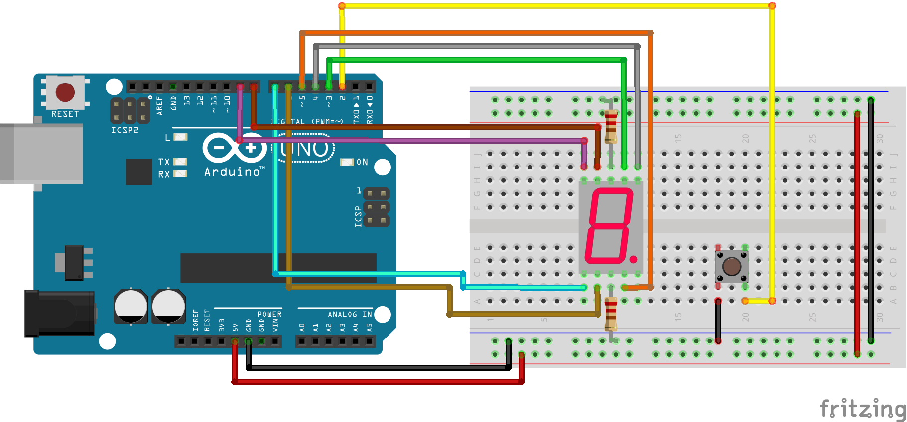

# Projeto Dado Digital no Arduino

Em casa jogamos muitos jogos em família, e por isso surgiu a ideia do **dado digital**, para incentivar meu filho na eletrônica e ao mesmo tempo usarmos no nosso dia a dia como brinquedo.

É simplesmente um dado digital, após ligado, pressiona o botão, alguns números aleatórios irão aparecer até que o valor final fixe no display.

*Versão final do projeto*

### Componentes

Usei um Arduino Uno R3 para fazer o projeto no protoboard, mas para colocar na caixa usei um Arduino Pro Mini por ser bem menor, também usei um botão mais bonitinho para colocar na caixa final.

* 1 Arduino Uno Rev3
* 1 Display de 7 segmentos 
* 2 resistores 220ohms
* 1 push-button
* 1 protoboard
* Alguns jumpers (fios para facilitar a ligação no arduino e protoboard)

Veja abaixo o esquema de ligação na protoboard.

*Esquema na protoboard*

### Código arduino
O código do arduino está na pasta "dado-digital".

